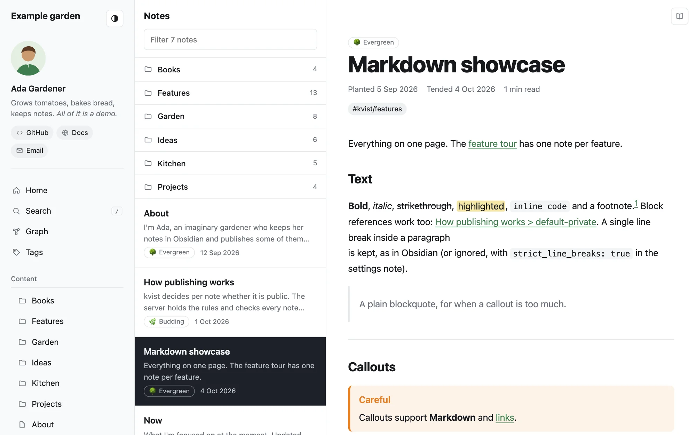

# kvist

**Publish your Obsidian notes as a website you own.**

kvist (Swedish for "twig") turns the notes you choose into a fast,
searchable digital garden on your own server. Write in Obsidian, press
Publish, and your site updates. Private notes never leave your device.



- **Obsidian syntax:** wikilinks, embeds, callouts, tags, footnotes, math
  and Mermaid diagrams.
- **Private stays private:** you choose what's public by folder, tag or
  property, and the server checks every note again. Links to private notes
  become plain text.
- **Search, backlinks and a graph,** in a three-pane theme with light and
  dark mode.
- **Settings in a note:** the site's title, menu and colors live in
  `_site.md`, so you change them from Obsidian on any device.
- **Links keep working:** a renamed or moved note's old address redirects
  to the new one.
- **In your language:** the theme's menus, dates and search speak English,
  Swedish, German, French or Spanish.
- **Self-hosted:** one small Go server in Docker, with HTTPS by Caddy. RSS,
  a sitemap, photo metadata stripping and optional cookie-free analytics
  included.

## Get started

**[Read the documentation →](https://klppl.github.io/kvist/)**

- [Getting started](https://klppl.github.io/kvist/getting-started.html):
  from an empty server to your first published notes, in about 30 minutes.
- [Publishing notes](https://klppl.github.io/kvist/publishing.html): what
  becomes public, and what stays private.
- [Customizing the site](https://klppl.github.io/kvist/customizing.html):
  title, home page, menu groups and colors.

The server runs from the Docker image `ghcr.io/klppl/kvist`. The Obsidian
plugin works on desktop and mobile: download
**[kvist-plugin.zip](https://github.com/klppl/kvist/releases/latest/download/kvist-plugin.zip)** and unzip it into your vault's
`.obsidian/plugins/` folder ([details](plugin/README.md)).

## Development

```sh
make build          # bin/kvist
make test           # Go tests
make plugin-test    # plugin tests
./bin/kvist dev --dir example-vault --config kvist.example.toml   # preview the demo site
```

Requires Go 1.26 or later, and Node 20+ for the plugin. Read
[CONTRIBUTING.md](CONTRIBUTING.md) before changing anything that affects
what gets published. Developer notes: [design](docs/design.md),
[sync protocol](docs/protocol.md), [content model](docs/content-model.md),
[themes](docs/themes.md), [deployment](docs/deploy.md). The user guide's
source is `docs/*.html`.

Licensed under the [Lagom License](LICENSE).
