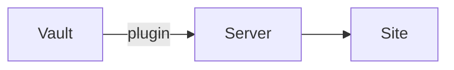

## Text

**Bold**, *italic*, ~~strikethrough~~, ==highlighted==, `inline code` and a
footnote.[^1] Block references work too: [[How publishing works#^default-private]].

[^1]: Footnotes are rendered at the bottom.

## Callouts

> [!warning] Careful
> Callouts support **Markdown** and [[Welcome|links]].

> [!example]- A folded callout
> Click the title to open it.

## Tasks and tables

- [x] Write the server
- [ ] Write the plugin

| Feature | Status |
|---|---|
| Wikilinks | ✓ |
| Embeds | ✓ |

## Code

```go
func greet(name string) string {
	return "Hello, " + name
}
```

## Math

Inline math like $e^{i\pi} + 1 = 0$, and a block:

$$
\int_0^1 x^2 \, dx = \frac{1}{3}
$$

## Diagrams


