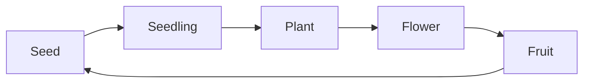
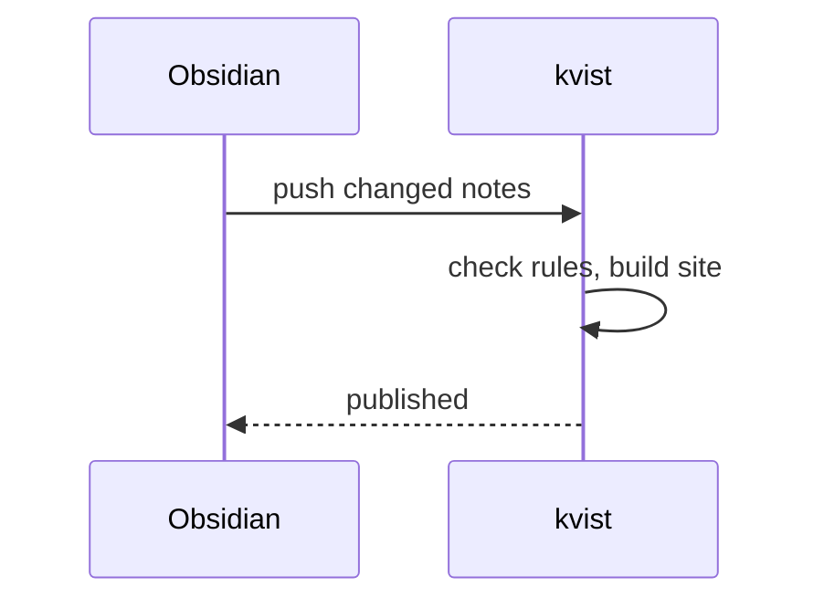
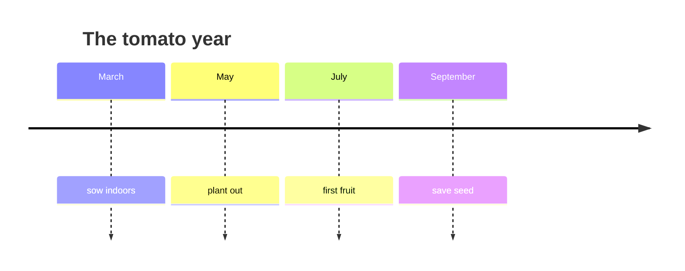
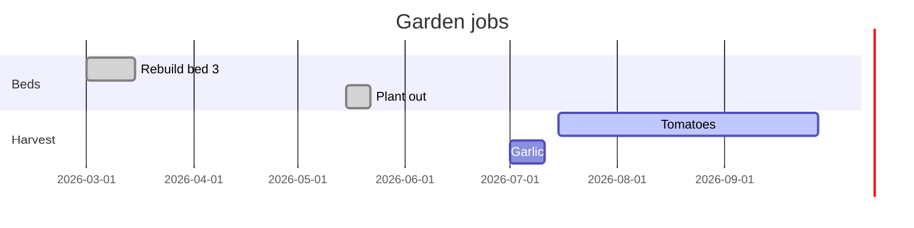

` ```mermaid ` blocks are drawn as diagrams. Mermaid only loads on pages that have one, and redraws when you switch between light and dark.

## Flowchart



## Sequence



## Timeline



## Gantt



More: [[How publishing works]], [[Composting]], [[Linking over filing]].
