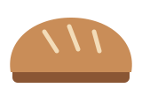

Images are attachments in the vault. They are published only because a published note uses them.

## Sizes

`![[tomato.svg|60]]` and `![[tomato.svg|120x120]]`:

![[tomato.svg|60]] ![[tomato.svg|120x120]]

## Alignment

`![[loaf.svg|right|150]]` floats the image right and lets the text flow around it:

![[loaf.svg|right|150]] Lorem ipsum is fine, but bread is better. A good loaf has an open crumb, a crust that crackles as it cools, and a slightly sour smell. The image to the right floats beside this paragraph on a wide screen and sits on its own line on a phone. Use `left` for the other side.

`![[sprout.svg|A sprout, centered|center|80]]` centers it and sets the description for screen readers:

![[sprout.svg|A sprout, centered|center|80]]

## Wide images

![[garden-plan.svg|The garden plan for 2026]]

## Markdown syntax

The Markdown form works too, with the same options in the alt text: ``.

 

## Social preview image

This note sets `image: "[[garden-cover.png]]"` in its properties. When the page is shared in a chat or on social media, that picture is shown. Notes without one use the site's image from the settings note.

## Metadata

Location, camera and author data are removed from JPEG, PNG and WebP images when they are published.
