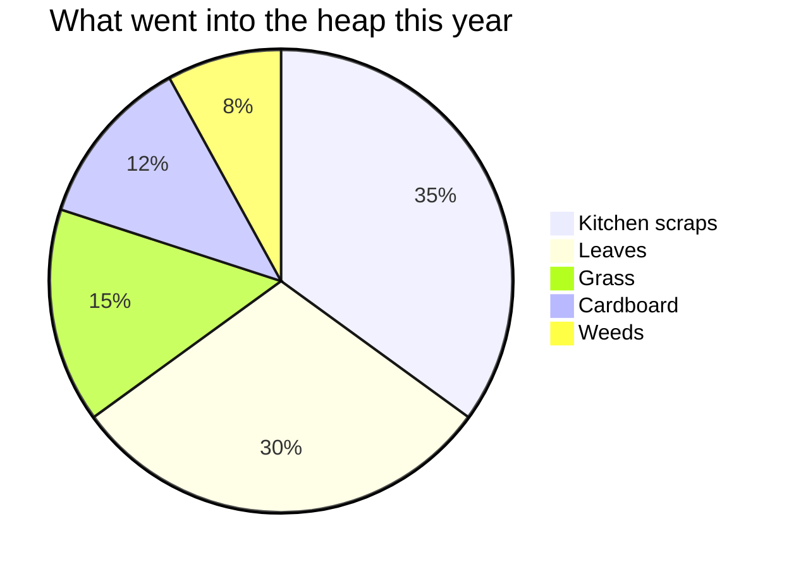

Compost is decomposed organic matter, and the best thing you can give [[Soil]].

## The recipe

Aim for roughly **three parts brown to one part green** by volume.

| Greens (nitrogen) | Browns (carbon) |
|---|---|
| vegetable scraps | dry leaves |
| grass clippings | cardboard, torn up |
| coffee grounds | straw |
| young weeds (no seeds) | wood chips |

## Hot or cold

- **Hot composting**: a big pile (at least 1 m³), turned weekly, reaches 55–65 °C and is done in two or three months.
- **Cold composting**: add things as they come and wait a year.

## Troubleshooting

> [!question]- It smells
> Too wet or too green. Add browns and turn it.

> [!question]- Nothing is happening
> Too dry or too brown. Add greens and a little water. It should feel like a wrung-out sponge.

> [!question]- There are flies
> Bury kitchen scraps in the middle of the pile.
