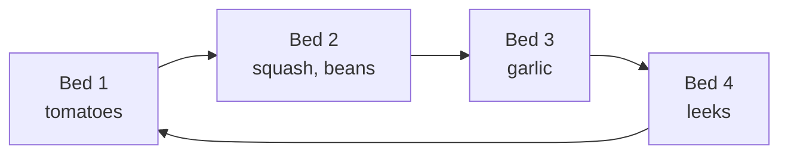

Four beds, rotated each year so no family grows in the same bed twice in a row.

![[garden-plan.svg]]

## Rotation

## Calendar

| Month | Job |
|---|---|
| March | sow tomatoes indoors |
| May | plant out after the last frost |
| July | harvest garlic, sow winter leeks |
| October | sow garlic, mulch, last compost turn |

## Tasks

- [x] Order seed
- [x] Rebuild bed 3 ([[Raised beds]])
- [x] Plant out tomatoes
- [ ] Sow garlic
- [ ] Mulch everything with leaves
