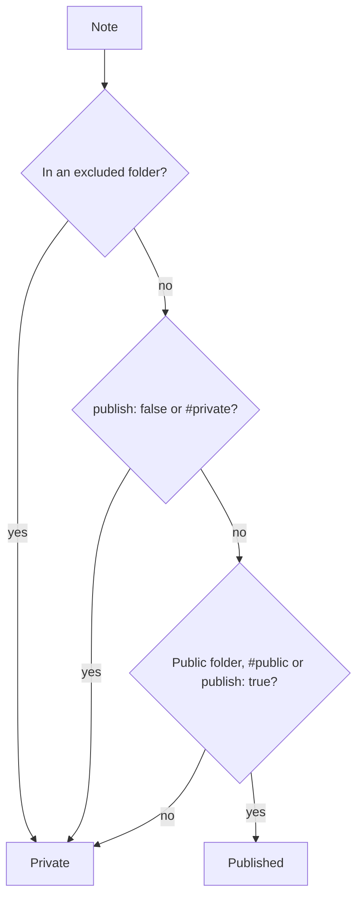

kvist decides per note whether it is public. The server holds the rules and checks every note again, even though the plugin already did.

## The rules

1. Notes in an excluded folder stay private.
2. `publish: false` or a `#private` tag keeps a note private.
3. Notes in an always-public folder, with a `#public` tag or with `publish: true` are published.
4. Everything else stays private. ^default-private

In this vault, `Kvist/` is always public and `Private/` and `Templates/` are excluded. [[Reading list]] lives outside `Kvist/` and uses the tag.

## Attachments

An attachment is published only when a published note links to or embeds it, or names it in its `image` or `cover` property. Unused files stay home.

## Links to private notes

A link to a private note becomes plain text, exactly like a link to a note that doesn't exist, so nobody can learn which private notes you have.

%% This comment never leaves the vault. %%
