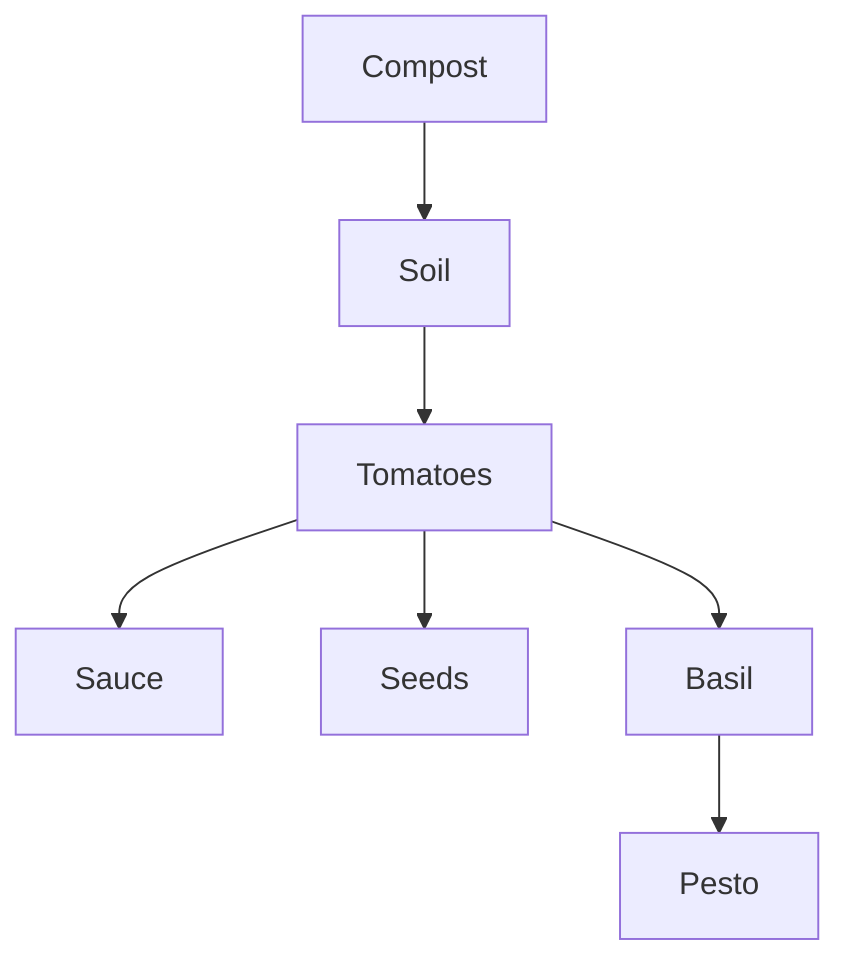

Folders force every note into exactly one place. Links let a note belong to as many contexts as it is relevant to.

In this garden, [[Tomatoes]] is linked from the garden, the kitchen and the plan. Its backlinks, at the bottom of the page, show every note that points to it, with the sentence around each link.

Open the **Graph** in the menu to see all links at once.
