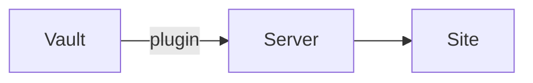

Everything on one page. The [[Features|feature tour]] has one note per feature.

## Text

**Bold**, *italic*, ~~strikethrough~~, ==highlighted==, `inline code` and a footnote.[^1] Block references work too: [[How publishing works#^default-private]]. A single line break inside a paragraph
is kept, as in Obsidian (or ignored, with `strict_line_breaks: true` in the settings note).

[^1]: Footnotes are rendered at the bottom.

> A plain blockquote, for when a callout is too much.

---

## Callouts

> [!warning] Careful
> Callouts support **Markdown** and [[Welcome|links]].

> [!example]- A folded callout
> Click the title to open it.

## Lists

1. Ordered
2. Lists
   - with nested
   - bullets

- [x] Write the server
- [x] Write the plugin
- [ ] Grow a better tomato

## Tables

| Feature | Status | Note |
|---|:---:|---:|
| Wikilinks | ✓ | [[Links and previews]] |
| Embeds | ✓ | [[Embeds]] |
| Video | ✓ | [[Video]] |

## Images

![[tomato.svg|right|90]] Images can be sized and floated. This tomato floats right, and the text wraps around it. See [[Images]] for every option.

## Code

```go
func greet(name string) string {
	return "Hello, " + name
}
```

## Math

Inline math like $e^{i\pi} + 1 = 0$, and a block:

$$
\int_0^1 x^2 \, dx = \frac{1}{3}
$$

## Diagrams



## Comments

There is a comment after this sentence %% that never leaves the vault %%, and an HTML one <!-- also removed -->.
