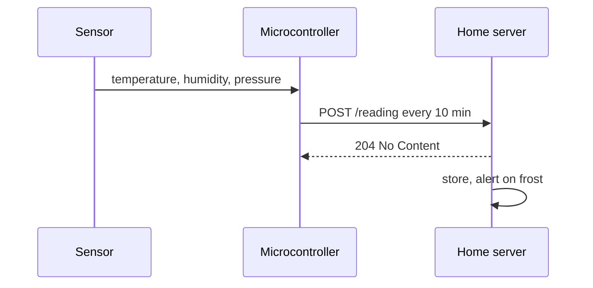

A microcontroller with a temperature, humidity and pressure sensor, sending a reading every ten minutes to a small server.

## How the data flows



## Frost alert

The part that actually matters for the garden:

```python
FROST_C = 2.0

def check(readings: list[float]) -> str | None:
    """Warn when the last three readings trend towards frost."""
    last = readings[-3:]
    if len(last) == 3 and last[0] > last[1] > last[2] and last[2] < FROST_C + 2:
        return f"Frost likely tonight: {last[2]:.1f} °C and falling"
    return None
```

And the receiving end, in Go:

```go
type Reading struct {
	Temp     float64   `json:"temp"`
	Humidity float64   `json:"humidity"`
	At       time.Time `json:"at"`
}

func handle(w http.ResponseWriter, r *http.Request) {
	var rd Reading
	if err := json.NewDecoder(r.Body).Decode(&rd); err != nil {
		http.Error(w, err.Error(), http.StatusBadRequest)
		return
	}
	store(rd)
	w.WriteHeader(http.StatusNoContent)
}
```

Config lives in a small file:

```yaml
interval: 10m
sensor: bme280
alerts:
  frost_below: 2.0
```
